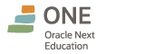

# Challenge - Decodificador de Textos

<!-- Badges do Topo -->

---

<!-- Tech Stack & DevSecOps Ecosystem -->

---

| Alura | Oracle |
| ----- | ------ |
|  |  |

---

O **Challenge ONE - Oracle Next Education** é um desafio proposto para criar uma aplicação web (*client-side*) capaz de criptografar e descriptografar textos. O projeto foi desenvolvido com base nos protótipos e diretrizes disponibilizados pela **Alura** via **Figma** e **Trello**.

---

## 📋 Especificações das Regras de Negócio

- Funcionar apenas com letras minúsculas;
- Não aceitar caracteres especiais ou acentuação;
- Possuir reversão do processo (descriptografia);
- **Padrão de "chaves"** de criptografia utilizadas:
  - A letra **"e"** é convertida para **"enter"**
  - A letra **"i"** é convertida para **"imes"**
  - A letra **"o"** é convertida para **"ober"**
  - A letra **"a"** é convertida para **"ai"**
  - A letra **"u"** é convertida para **"ufat"**

**Tempo de desenvolvimento e Metodologia:** O projeto foi desenvolvido em **quatro semanas**, seguindo a **metodologia ágil**.

---

## 🔗 Links

- [Acesse a Aplicação (Live Demo)](https://mdsoare.github.io/decodificador/)
- [Challenge ONE](https://lp.alura.com.br/alura-latam-entrega-challenge-one-portugues)
- [Live ONE T6](https://www.youtube.com/watch?v=XlfNkUeHYgE)
- [Trello Board](https://trello.com/b/EmUFmjCv/decodificador-de-texto-alura-challenges-oracle-one)
- [Figma Spec](https://www.figma.com/file/tvFEYhVfZTjdJ5P24RGV21/Alura-Challenge---Desafio-1---L%C3%B3gica?type=design&node-id=0-1&mode=design&t=B6ZgXYblW4880u2K-0)
- [Alura - Artigos Front-End](https://www.alura.com.br/artigos/como-colocar-projeto-no-ar-com-github-pages)
- [W3Schools](https://www.w3schools.com/)
- [MDN Web Docs](https://developer.mozilla.org/pt-BR/)

---

## 🌐 Redes Sociais

 

<table>
  <tr>
    <td>
      
    </td>
    <td align="left">
      <a href="https://www.linkedin.com/in/marcelodsoares/">
        <b>Marcelo Soares</b>
      </a>
       
      Analista de Sistemas / DevSecOps
    </td>
  </tr>
</table>

---

## 🛠️ Tecnologias & Ecossistema DevSecOps

- **Frontend:** HTML5, Pure CSS3 (Dark Theme) e Vanilla JavaScript (ES6+ sem dependências de runtime).
- **Gerenciamento & Pacotes:** Node.js & npm (DevDependencies e Scripts de Linting/Auditoria).
- **Automação & CI/CD:** GitHub Actions & GitHub Dependabot.
- **Segurança Estática (SAST):** CodeQL, Horusec, Semgrep, ESLint (Flat Config), Stylelint, HTMLHint e TruffleHog (Secret Scanning).
- **Análise de Dependências & Misconfig (SCA):** OSV-Scanner, Trivy Scan e `npm audit`.
